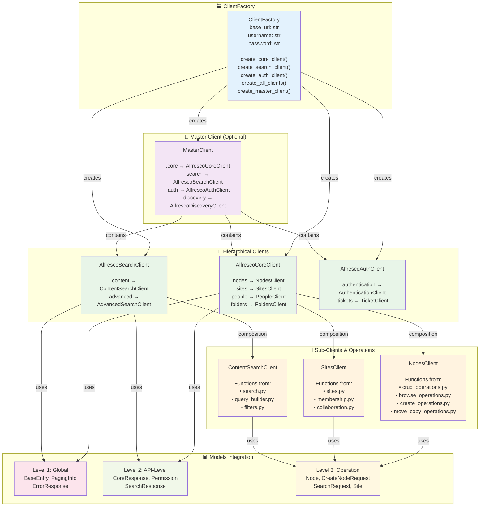

# Architecture Diagram and Overview - V1.1

**🏗️ ARCHITECTURE OVERVIEW**: Complete V1.1 hierarchical architecture with ClientFactory patterns, Master Client, and comprehensive visual diagrams.

## 🏢 **ALFRESCO CORE CLIENT HIERARCHY**

### **AlfrescoCoreClient Level**
- **Models Used**: Level 1 (Global) + Level 2 (Core API)
- **Purpose**: Main client orchestration and common Core API models
- **File**: `python_alfresco_api/clients/core/core_client.py`

### **NodesClient Level** 
- **Models Used**: Level 3 (Node-specific) models
- **Sub-operations**: Referenced in separate operation files
- **Structure**:
  ```python
  # In core_client.py
  class AlfrescoCoreClient:
      def __init__(self):
          self.nodes = NodesClient(self)  # Composition pattern
  
  # Sub-operation files (functions, not classes):
  # - crud_operations.py      # get(), create(), update(), delete()  
  # - browse_operations.py    # list_children(), get_parents()
  # - create_operations.py    # create_folder(), create_content()
  # - move_copy_operations.py # move(), copy(), link()
  ```

### **Operation Files Structure**
Each operation file contains **functions** (not classes) that use Level 3 models:

```python
# python_alfresco_api/clients/core/nodes/crud_operations.py
from .models import Node, CreateNodeRequest, UpdateNodeRequest, NodeEntry

def get(core_client, node_id: str, include: Optional[List[str]] = None) -> Node:
    """Get a single node by ID"""
    # Implementation using Node model

def create(core_client, request: CreateNodeRequest, parent_id: str) -> Node:
    """Create a new node"""
    # Implementation using CreateNodeRequest and returning Node

def update(core_client, node_id: str, request: UpdateNodeRequest) -> Node:
    """Update an existing node"""
    # Implementation using UpdateNodeRequest and returning Node
```

## 🏭 **CLIENT FACTORY AND MASTER CLIENT**

### **🏗️ V1.1 Hierarchical Architecture Diagram**
The following diagram shows the complete V1.1 architecture with ClientFactory, Master Client, and model integration:



### **ClientFactory Integration**

```python
# python_alfresco_api/client_factory.py
from .clients.core.core_client import AlfrescoCoreClient
from .clients.search.search_client import AlfrescoSearchClient
from .clients.auth.auth_client import AlfrescoAuthClient

class ClientFactory:
    """Factory for creating all client types with shared configuration"""
    
    def __init__(self, base_url: str, username: str, password: str):
        self.base_url = base_url
        self.auth_config = (username, password)
    
    def create_core_client(self) -> AlfrescoCoreClient:
        """Create Core API client with Level 1, 2, and 3 models"""
        return AlfrescoCoreClient(
            base_url=self.base_url,
            auth=self.auth_config
        )
    
    def create_search_client(self) -> AlfrescoSearchClient:
        """Create Search API client with its specific models"""
        return AlfrescoSearchClient(
            base_url=self.base_url, 
            auth=self.auth_config
        )
```

### **Master Client (Optional Pattern)**

```python
# python_alfresco_api/clients/master_client.py
from .core.core_client import AlfrescoCoreClient
from .search.search_client import AlfrescoSearchClient
from .auth.auth_client import AlfrescoAuthClient

class MasterClient:
    """Unified access to all APIs with dot notation"""
    
    def __init__(self, factory: ClientFactory):
        self.core = factory.create_core_client()      # Uses Core models (L1+L2+L3)
        self.search = factory.create_search_client()  # Uses Search models (L1+L2+L3)
        self.auth = factory.create_auth_client()      # Uses Auth models (L1+L2+L3)
        
    # Access pattern: master.core.nodes.get("node-id")
    #                master.search.content.query(search_request)
    #                master.auth.tickets.create(login_request)
```

## 📖 **RELATED DOCUMENTATION**

- [Pydantic Models Guide](PYDANTIC_MODELS_GUIDE.md) - Model levels and integration patterns
- [Client Types Guide](CLIENT_TYPES_GUIDE.md) - Three types of clients and when to use each
- [V1.1 Hierarchical Architecture](arch/V1_1_FINAL_ARCHITECTURE_DECISION.md) - Complete architecture overview
- [API Documentation Index](API_DOCUMENTATION_INDEX.md) - Complete API reference

---

**Key Takeaway**: The V1.1 architecture provides a complete hierarchical system from ClientFactory through Master Client to operation-specific implementations, with full Pydantic model integration at every level. 