# Client Types Guide - V1.1 Three-Tier Architecture

**🎯 CLIENT HIERARCHY**: Understanding the three distinct client types in the V1.1 architecture and when to use each for optimal development experience.

## 🏗️ **THREE CLIENT TYPES OVERVIEW**

| Client Type | Technology | Models | Best For | Integration Effort |
|-------------|------------|--------|----------|-------------------|
| **🌟 Hierarchical APIs** | V1.1 three-tier wrapper | Native Pydantic | Application development, MCP servers | ✅ **Zero** - Direct usage |
| **🔧 Raw Generated Clients** | `openapi-python-client` | attrs models | Advanced operations, debugging | 🟡 **Medium** - Dictionary conversion |
| **⚡ HTTPx Clients** | Direct HTTP access | Manual JSON | Custom endpoints, troubleshooting | 🔴 **High** - Manual everything |

### **📊 Client Types Hierarchy Diagram**
The following diagram illustrates the three client types and their relationships:

```mermaid
graph TD
    subgraph "🌟 Level 1: Hierarchical APIs"
        H1["`**AlfrescoCoreClient**
        • Native Pydantic models
        • Sensible defaults
        • Type safety
        • Error handling`"]
        
        H2["`**core_client.nodes**
        • create_folder()
        • create_content()  
        • get()
        • update()`"]
        
        H3["`**core_client.sites**
        • create()
        • join()
        • list_members()`"]
    end
    
    subgraph "🔧 Level 2: Raw Generated Clients"
        R1["`**Raw Core Client**
        • Direct OpenAPI mapping
        • attrs models
        • Manual conversion
        • Full HTTP control`"]
        
        R2["`**create_node.sync()**
        • parent_node_id
        • body (dict)
        • include params`"]
        
        R3["`**get_node.sync()**
        • node_id
        • include params
        • custom headers`"]
    end
    
    subgraph "⚡ Level 3: HTTPx Clients"
        X1["`**HTTPx Client**
        • Raw HTTP requests
        • Manual JSON handling
        • Custom endpoints
        • Full flexibility`"]
        
        X2["`**POST /nodes/-my-/children**
        • Manual URL construction
        • Custom headers
        • Error handling`"]
        
        X3["`**Custom Webscripts**
        • /alfresco/s/api/custom/
        • Enterprise extensions
        • Non-standard patterns`"]
    end
    
    H1 --> H2
    H1 --> H3
    H1 -.->|"get_raw_client()"| R1
    H1 -.->|"get_httpx_client()"| X1
    
    R1 --> R2
    R1 --> R3
    R1 -.->|"get_httpx_client()"| X1
    
    X1 --> X2
    X1 --> X3
    
    style H1 fill:#e8f5e8
    style H2 fill:#e8f5e8
    style H3 fill:#e8f5e8
    style R1 fill:#fff3cd
    style R2 fill:#fff3cd
    style R3 fill:#fff3cd
    style X1 fill:#f8d7da
    style X2 fill:#f8d7da
    style X3 fill:#f8d7da
```



## 🌟 **LEVEL 1: HIERARCHICAL APIs (Recommended)**

### **Purpose & Design Philosophy**
- **Intuitive Operations**: Natural method names like `create_folder()`, `search_content()`
- **Sensible Defaults**: Common parameters pre-configured (parent="-my-", include=["path"])
- **Type Safety**: Native Pydantic model integration with IDE support
- **Error Handling**: Graceful error messages and automatic retries
- **Developer Experience**: Optimized for productivity and ease of use

### **Architecture Pattern**
```python
# Three-tier access pattern
factory = ClientFactory(base_url="http://localhost:8080", username="admin", password="admin")
core_client = factory.create_core_client()

# Level 1: API Client (AlfrescoCoreClient)
# Level 2: Operation Group (core_client.nodes)  
# Level 3: Specific Operation (core_client.nodes.create_folder)
result = core_client.nodes.create_folder(name="Documents", parent_id="-my-")
```

### **✅ Perfect For:**
- **Application Development**: Business logic and user-facing features
- **MCP Server Development**: AI tool integration with type safety
- **Rapid Prototyping**: Quick development with sensible defaults
- **Enterprise Applications**: Robust error handling and logging
- **Learning/Training**: Intuitive API that mirrors business concepts

### **Example Usage Patterns**

#### **Content Management**
```python
from python_alfresco_api import ClientFactory
from python_alfresco_api.clients.core.nodes.models import CreateNodeRequest

factory = ClientFactory.from_env()  # Uses environment variables
core_client = factory.create_core_client()

# 🌟 Native Pydantic integration
create_request = CreateNodeRequest(
    name="project-proposal.pdf",
    nodeType="cm:content",
    properties={
        "cm:title": "Project Proposal 2024",
        "cm:description": "Annual project planning document"
    }
)

# Direct model usage - no conversion needed
document = core_client.nodes.create_content(
    request=create_request,
    content=pdf_bytes,
    parent_id="-my-",
    content_type="application/pdf"
)

print(f"✅ Created: {document.name} (ID: {document.id})")
```

#### **Search Operations**
```python
from python_alfresco_api.clients.search.models import SearchRequest, RequestQuery

# Type-safe search construction
search_request = SearchRequest(
    query=RequestQuery(
        query="TYPE:'cm:content' AND TEXT:'proposal'",
        language="afts"
    ),
    paging={"maxItems": 25, "skipCount": 0},
    include=["path", "properties", "allowableOperations"]
)

# Execute with full type safety
results = core_client.search.query(search_request)
for entry in results.entries:
    node = entry.entry
    print(f"📄 {node.name} - Modified: {node.modifiedAt}")
```

#### **Site Management**
```python
from python_alfresco_api.clients.core.sites.models import CreateSiteRequest

# Create collaboration site
site_request = CreateSiteRequest(
    id="project-alpha",
    title="Project Alpha",
    description="Collaboration space for Project Alpha",
    visibility="MODERATED"
)

site = core_client.sites.create(site_request)
print(f"🏢 Created site: {site.title} (ID: {site.id})")
```

## 🔧 **LEVEL 2: RAW GENERATED CLIENTS**

### **Purpose & Design Philosophy**
- **Direct OpenAPI Mapping**: One-to-one mapping with REST API endpoints
- **Full Control**: Access to all HTTP parameters and headers
- **attrs Models**: Generated models with dataclasses-style attributes
- **Debugging**: Detailed request/response information for troubleshooting
- **Advanced Operations**: Complex operations not wrapped by hierarchical APIs

### **Architecture Pattern**
```python
# Direct raw client access
from python_alfresco_api.raw_clients.alfresco_core_client import Client as CoreRawClient
from python_alfresco_api.auth_util import AuthUtil

auth = AuthUtil("admin", "admin")
raw_client = CoreRawClient(
    base_url="http://localhost:8080/alfresco/api/-default-/public/alfresco/versions/1",
    auth=auth
)

# Direct OpenAPI operation calls
response = raw_client.create_node.sync(
    parent_node_id="-my-",
    body={"name": "document.pdf", "nodeType": "cm:content"}
)
```

### **✅ Perfect For:**
- **Advanced API Operations**: Operations not yet wrapped by hierarchical APIs
- **Custom HTTP Headers**: Special authentication or tracking headers
- **Debugging API Issues**: Detailed request/response logging
- **Performance Optimization**: Minimal overhead for bulk operations
- **OpenAPI Exploration**: Understanding the raw REST API structure

### **Integration Pattern with Pydantic Models**
```python
from python_alfresco_api.models.alfresco_core_models import NodeBodyCreate
from python_alfresco_api.raw_clients.alfresco_core_client import Client as CoreRawClient

# 🔧 Manual conversion required
node_model = NodeBodyCreate(
    name="document.pdf",
    nodeType="cm:content",
    properties={"cm:title": "Important Document"}
)

# Convert Pydantic to dictionary for raw client
node_dict = node_model.model_dump()

# Use raw client with converted data
response = raw_client.create_node.sync(
    parent_node_id="-my-",
    body=node_dict
)

# Response is attrs object, convert to dict if needed
response_dict = response.to_dict() if hasattr(response, 'to_dict') else response
```

### **Advanced Usage Examples**

#### **Bulk Operations**
```python
import asyncio
from python_alfresco_api.raw_clients.alfresco_core_client import AsyncClient

async def bulk_create_nodes(node_data_list: List[dict], parent_id: str):
    """Create multiple nodes efficiently with raw async client"""
    async_client = AsyncClient(base_url=base_url, auth=auth)
    
    tasks = []
    for node_data in node_data_list:
        task = async_client.create_node.asyncio(
            parent_node_id=parent_id,
            body=node_data
        )
        tasks.append(task)
    
    # Execute all creations in parallel
    results = await asyncio.gather(*tasks, return_exceptions=True)
    return results
```

#### **Custom Headers and Parameters**
```python
# Access underlying httpx client for custom headers
httpx_client = raw_client.get_httpx_client()
custom_headers = {
    "X-Alfresco-Remote-User": "system",
    "X-Custom-Tracking-ID": "batch-job-123"
}

response = httpx_client.post(
    "/nodes/-my-/children",
    json=node_dict,
    headers=custom_headers,
    params={"include": "path,properties,permissions"}
)
```

## ⚡ **LEVEL 3: HTTPx CLIENTS**

### **Purpose & Design Philosophy**
- **Direct HTTP Access**: Raw HTTP requests with full control
- **Manual Everything**: Complete responsibility for URL construction, auth, parsing
- **Maximum Flexibility**: Handle any HTTP pattern or non-standard endpoint
- **Debugging & Exploration**: Direct REST API interaction for troubleshooting
- **Custom Integrations**: Non-standard endpoints or authentication methods

### **Architecture Pattern**
```python
# Direct HTTPx access through hierarchical client
core_client = factory.create_core_client()
httpx_client = core_client.get_httpx_client()

# Manual URL construction and JSON handling
response = httpx_client.post(
    "/alfresco/api/-default-/public/alfresco/versions/1/nodes/-my-/children",
    json={
        "name": "document.pdf",
        "nodeType": "cm:content",
        "properties": {"cm:title": "Manual Creation"}
    }
)

# Manual response parsing
if response.status_code == 201:
    result = response.json()
    print(f"Created node: {result['entry']['name']}")
```

### **✅ Perfect For:**
- **Custom Endpoints**: Non-standard or enterprise-specific endpoints
- **Authentication Troubleshooting**: Testing different auth methods
- **API Exploration**: Understanding raw REST API behavior
- **Special HTTP Patterns**: Custom headers, unusual parameter formats
- **Integration Testing**: Low-level HTTP testing scenarios

### **Usage Examples**

#### **Custom Authentication Testing**
```python
import httpx
import base64

# Test different authentication methods manually
def test_ticket_auth(ticket: str):
    """Test ticket-based authentication"""
    headers = {"X-Alfresco-Ticket": ticket}
    
    with httpx.Client(base_url="http://localhost:8080") as client:
        response = client.get(
            "/alfresco/api/-default-/public/alfresco/versions/1/nodes/-my-",
            headers=headers
        )
        return response.status_code == 200

def test_basic_auth(username: str, password: str):
    """Test basic authentication"""
    auth_header = base64.b64encode(f"{username}:{password}".encode()).decode()
    headers = {"Authorization": f"Basic {auth_header}"}
    
    with httpx.Client(base_url="http://localhost:8080") as client:
        response = client.get(
            "/alfresco/api/-default-/public/alfresco/versions/1/nodes/-my-",
            headers=headers
        )
        return response.status_code == 200
```

#### **Custom Endpoint Integration**
```python
def call_custom_webscript(core_client, script_name: str, params: dict):
    """Call custom Alfresco webscript"""
    httpx_client = core_client.get_httpx_client()
    
    # Custom webscript URL
    response = httpx_client.get(
        f"/alfresco/s/api/custom/{script_name}",
        params=params
    )
    
    if response.status_code == 200:
        return response.json()
    else:
        raise Exception(f"Webscript failed: {response.text}")

# Usage
custom_data = call_custom_webscript(
    core_client, 
    "metadata-export", 
    {"format": "json", "include": "properties"}
)
```

## 🎯 **DECISION MATRIX: WHICH CLIENT TO USE?**

### **🌟 Use Hierarchical APIs When:**
- ✅ Building application features
- ✅ Developing MCP servers  
- ✅ Need type safety and validation
- ✅ Want sensible defaults and error handling
- ✅ Prioritizing developer productivity
- ✅ Working with standard Alfresco operations

### **🔧 Use Raw Generated Clients When:**
- ⚠️ Need access to advanced OpenAPI parameters
- ⚠️ Debugging API issues requiring detailed logging
- ⚠️ Building performance-critical bulk operations
- ⚠️ Working with operations not wrapped yet
- ⚠️ Need specific HTTP headers or authentication
- ⚠️ Exploring the raw REST API structure

### **⚡ Use HTTPx Clients When:**
- 🔴 Calling custom or non-standard endpoints
- 🔴 Testing different authentication methods
- 🔴 Need complete control over HTTP requests
- 🔴 Working with enterprise-specific extensions
- 🔴 Debugging low-level HTTP issues
- 🔴 Integrating with custom Alfresco webscripts

## 🔄 **CLIENT INTEROPERABILITY**

### **Mixing Client Types**
```python
# Start with hierarchical for ease of use
core_client = factory.create_core_client()

# Use hierarchical for standard operations
folder = core_client.folders.create(name="Project Files", parent_id="-my-")

# Switch to raw client for advanced operation
raw_client = core_client.get_raw_client()
advanced_response = raw_client.set_node_permissions.sync(
    node_id=folder.id,
    body={
        "permissions": {
            "isInheritanceEnabled": False,
            "locallySet": [
                {"authorityId": "GROUP_USERS", "name": "Contributor", "accessStatus": "ALLOWED"}
            ]
        }
    }
)

# Use HTTPx for custom webscript
httpx_client = core_client.get_httpx_client()
custom_result = httpx_client.post(
    f"/alfresco/s/api/custom/folder-setup/{folder.id}",
    json={"template": "project-structure"}
)
```

### **Unified Error Handling**
```python
from python_alfresco_api.exceptions import AlfrescoAPIError

def robust_content_creation(core_client, content_data: dict):
    """Create content with fallback strategies"""
    try:
        # Try hierarchical first (recommended)
        result = core_client.nodes.create_content(**content_data)
        return result
    except AlfrescoAPIError as e:
        print(f"Hierarchical failed: {e}, trying raw client...")
        
        try:
            # Fallback to raw client
            raw_client = core_client.get_raw_client()
            response = raw_client.create_node.sync(
                parent_node_id=content_data["parent_id"],
                body=content_data
            )
            return response.entry
        except Exception as e2:
            print(f"Raw client failed: {e2}, trying direct HTTP...")
            
            # Final fallback to HTTPx
            httpx_client = core_client.get_httpx_client()
            response = httpx_client.post("/nodes/-my-/children", json=content_data)
            if response.status_code == 201:
                return response.json()["entry"]
            else:
                raise Exception(f"All methods failed. Final error: {response.text}")
```

## 📖 **RELATED DOCUMENTATION**

- [Pydantic Models Guide](PYDANTIC_MODELS_GUIDE.md) - Model levels and integration patterns
- [V1.1 Hierarchical Architecture](arch/V1_1_FINAL_ARCHITECTURE_DECISION.md) - Complete architecture overview
- [Authentication Guide](AUTHENTICATION_GUIDE.md) - Authentication patterns across client types
- [API Documentation Index](API_DOCUMENTATION_INDEX.md) - Complete API reference

---

**Key Takeaway**: The three client types form a hierarchy from high-level convenience (Hierarchical) to maximum control (HTTPx), allowing developers to choose the right abstraction level for each specific use case. 