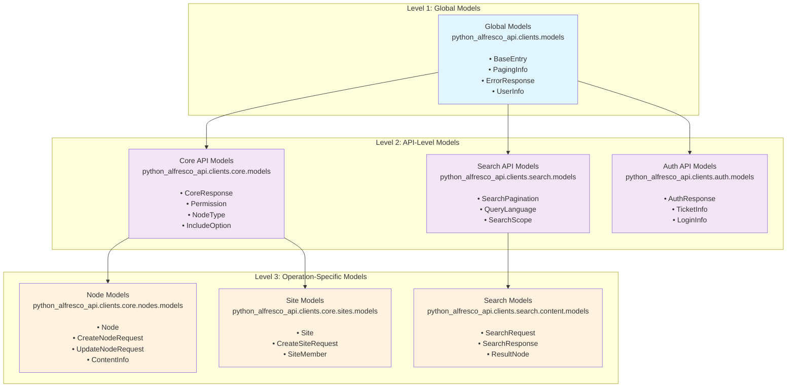

# Pydantic Models Guide - V1.1 Three-Tier Architecture

**🏗️ MODEL LEVELS**: Understanding where and how Pydantic models are introduced across the V1.1 three-tier hierarchical architecture.

## 🎯 **MODEL INTRODUCTION LEVELS**

### **📊 Three-Tier Model Architecture Diagram**
The following diagram illustrates how models are organized across the three architectural levels:



### **Level 1: Global Models** 
- **Where**: `python_alfresco_api.clients.models`
- **Introduced At**: Package level - shared across ALL APIs
- **Purpose**: Universal data structures used by multiple APIs
- **Examples**: `BaseEntry`, `PagingInfo`, `ErrorResponse`, `UserInfo`

### **Level 2: API-Level Models**
- **Where**: `python_alfresco_api.clients.{api}.models`
- **Introduced At**: API client level - shared within ONE API
- **Purpose**: Common structures for a specific API (Core, Search, etc.)
- **Examples**: `CoreResponse`, `Permission`, `NodeType`, `SearchPagination`

### **Level 3: Operation-Specific Models**
- **Where**: `python_alfresco_api.clients.{api}.{operation}.models`
- **Introduced At**: Operation group level - specific to ONE operation set
- **Purpose**: Specialized models for specific operations
- **Examples**: `Node`, `CreateNodeRequest`, `SearchRequest`, `Site`

## 📂 **CONCEPTUAL VS ACTUAL FILE STRUCTURE**

### **Conceptual Documentation Structure:**
```
docs/
├── core/
│   ├── core_models.md          # All Core API models in one doc
│   ├── nodes/
│   │   ├── nodes_api.md        # Node operations
│   │   └── nodes_models.md     # Node-specific models
│   ├── sites/
│   │   ├── sites_api.md        # Site operations  
│   │   └── sites_models.md     # Site-specific models
│   └── folders/
│       ├── folders_api.md      # Folder operations
│       └── folders_models.md   # Folder-specific models
```

### **Actual Code Hierarchy (More Granular):**
```
python_alfresco_api/clients/
├── models.py                    # Level 1: Global models
├── core/
│   ├── models.py               # Level 2: Core API models
│   ├── core_client.py          # Main AlfrescoCoreClient
│   ├── nodes/
│   │   ├── models.py           # Level 3: Node models
│   │   ├── crud_operations.py  # Node CRUD functions
│   │   ├── browse_operations.py # Node browsing functions
│   │   ├── create_operations.py # Node creation functions
│   │   └── move_copy_operations.py # Node move/copy functions
│   ├── sites/
│   │   ├── models.py           # Level 3: Site models
│   │   └── sites.py            # Site operations
│   └── folders/
│       ├── models.py           # Level 3: Folder models
│       └── folders.py          # Folder operations
```

## 🏗️ **THREE-TIER MODEL ARCHITECTURE DETAILED**

### **Level 1 Global Models - Package Foundation**

```python
# python_alfresco_api/clients/models.py
from typing import List, Optional, Any, Dict
from pydantic import BaseModel, Field

class BaseEntry(BaseModel):
    """Foundation model used across all APIs"""
    id: str = Field(..., description="Unique identifier")
    
class PagingInfo(BaseModel):
    """Pagination information used across all APIs"""
    count: int = Field(..., description="Number of items returned")
    hasMoreItems: bool = Field(..., description="Whether more items exist")
    totalItems: Optional[int] = Field(None, description="Total number of items")
    skipCount: int = Field(0, description="Number of items skipped")
    maxItems: int = Field(100, description="Maximum items per page")

class ErrorResponse(BaseModel):
    """Standard error response across all APIs"""
    statusCode: int = Field(..., description="HTTP status code")
    briefSummary: str = Field(..., description="Brief error summary")
    stackTrace: Optional[str] = Field(None, description="Stack trace for debugging")
    descriptionURL: Optional[str] = Field(None, description="URL with more details")

# Used by ALL APIs - Core, Search, Discovery, Auth, etc.
```

### **Level 2 API Models - Core API Shared Models**

```python
# python_alfresco_api/clients/core/models.py
from ..models import BaseEntry, PagingInfo
from typing import List, Optional, Dict, Any
from pydantic import BaseModel, Field

class CoreResponse(BaseModel):
    """Standard response wrapper for Core API operations"""
    entry: Optional[BaseEntry] = Field(None, description="Single entry response")
    list: Optional['CoreEntryList'] = Field(None, description="List response")

class CoreEntryList(BaseModel):
    """List wrapper for Core API responses"""
    pagination: PagingInfo = Field(..., description="Pagination information")
    entries: List[Dict[str, Any]] = Field(..., description="List of entries")

class Permission(BaseModel):
    """Permission information shared across Core API operations"""
    authorityId: str = Field(..., description="Authority identifier")
    name: str = Field(..., description="Permission name")
    accessStatus: str = Field(..., description="Access status (ALLOWED/DENIED)")

class NodeType(BaseModel):
    """Node type information used across node operations"""
    id: str = Field(..., description="Node type identifier")
    title: Optional[str] = Field(None, description="Display title")
    description: Optional[str] = Field(None, description="Type description")

# Used by all Core API operations - nodes, sites, people, etc.
```

### **Level 3 Operation Models - Nodes Specific**

```python
# python_alfresco_api/clients/core/nodes/models.py
from ..models import CoreResponse, Permission, NodeType
from ...models import BaseEntry
from typing import List, Optional, Dict, Any, Union
from datetime import datetime
from pydantic import BaseModel, Field

class ContentInfo(BaseModel):
    """Content-specific information for file nodes"""
    mimeType: str = Field(..., description="MIME type of content")
    mimeTypeName: Optional[str] = Field(None, description="Human readable MIME type")
    sizeInBytes: Optional[int] = Field(None, description="Size in bytes")
    encoding: Optional[str] = Field(None, description="Content encoding")

class Node(BaseEntry):
    """Core node model with all properties"""
    name: str = Field(..., description="Node name")
    nodeType: str = Field(..., description="Node type (cm:content, cm:folder, etc.)")
    isFolder: bool = Field(..., description="Whether this is a folder")
    isFile: bool = Field(..., description="Whether this is a file")
    modifiedAt: datetime = Field(..., description="Last modification time")
    modifiedByUser: Optional[Dict[str, Any]] = Field(None, description="User who modified")
    createdAt: datetime = Field(..., description="Creation time")
    createdByUser: Optional[Dict[str, Any]] = Field(None, description="User who created")
    parentId: Optional[str] = Field(None, description="Parent node ID")
    isLink: Optional[bool] = Field(None, description="Whether this is a link")
    content: Optional[ContentInfo] = Field(None, description="Content information")
    aspectNames: Optional[List[str]] = Field(None, description="Applied aspects")
    properties: Optional[Dict[str, Any]] = Field(None, description="Node properties")
    allowableOperations: Optional[List[str]] = Field(None, description="Available operations")
    path: Optional[Dict[str, Any]] = Field(None, description="Path information")
    permissions: Optional[Dict[str, Any]] = Field(None, description="Permission information")

class CreateNodeRequest(BaseModel):
    """Request model for creating new nodes"""
    name: str = Field(..., description="Name for the new node")
    nodeType: str = Field("cm:content", description="Node type to create")
    aspectNames: Optional[List[str]] = Field(None, description="Aspects to apply")
    properties: Optional[Dict[str, Any]] = Field(None, description="Properties to set")
    relativePath: Optional[str] = Field(None, description="Relative path for creation")
    association: Optional[Dict[str, Any]] = Field(None, description="Association information")

class UpdateNodeRequest(BaseModel):
    """Request model for updating existing nodes"""
    name: Optional[str] = Field(None, description="New name for the node")
    nodeType: Optional[str] = Field(None, description="New node type")
    aspectNames: Optional[List[str]] = Field(None, description="Aspects to apply/remove")
    properties: Optional[Dict[str, Any]] = Field(None, description="Properties to update")
    permissions: Optional[Dict[str, Any]] = Field(None, description="Permissions to update")

class NodeEntry(BaseModel):
    """Wrapper for single node responses"""
    entry: Node = Field(..., description="Node data")

class NodePaging(BaseModel):
    """Paged collection of nodes"""
    list: CoreEntryList = Field(..., description="Paged list of nodes")

# Used specifically by node operations in core_client.nodes.*
```

## 🏗️ **COMPLETE ARCHITECTURE OVERVIEW**

For detailed information about the V1.1 hierarchical architecture, ClientFactory patterns, Master Client implementation, and comprehensive visual diagrams, see:

**👉 [Architecture Diagram and Overview](ARCH_DIAGRAM_AND_OVERVIEW.md)**

This dedicated guide covers:
- **Alfresco Core Client Hierarchy** - Multi-level client organization
- **ClientFactory & Master Client** - Complete architecture diagram and patterns
- **Client Integration** - Factory patterns and unified access
- **Visual Architecture** - Comprehensive Mermaid diagrams

## 🎯 **MODEL USAGE PATTERNS BY LEVEL**

### **Level 1 Global Models - Universal Usage**
```python
# Used everywhere for consistency
from python_alfresco_api.clients.models import PagingInfo, ErrorResponse

# In any API response
def handle_paging(paging: PagingInfo):
    print(f"Showing {paging.count} of {paging.totalItems} items")

def handle_error(error: ErrorResponse):
    print(f"Error {error.statusCode}: {error.briefSummary}")
```

### **Level 2 API Models - API-Specific Usage**
```python
# Used within Core API operations
from python_alfresco_api.clients.core.models import CoreResponse, Permission

def check_permissions(perms: List[Permission]) -> bool:
    return any(p.accessStatus == "ALLOWED" for p in perms)
```

### **Level 3 Operation Models - Operation-Specific Usage**
```python
# Used for specific node operations
from python_alfresco_api.clients.core.nodes.models import Node, CreateNodeRequest

# Create operation
create_req = CreateNodeRequest(
    name="document.pdf",
    nodeType="cm:content",
    properties={"cm:title": "Important Document"}
)

# Result is Node model
result: Node = core_client.nodes.create(create_req, parent_id="-my-")
```

## 📊 **MODEL GENERATION AND EVOLUTION**

### **Current Generation Pipeline:**
1. **OpenAPI Specs** → `datamodel-code-generator` → **Level 1, 2, 3 Pydantic Models**
2. **Templates** → **Client Classes** → **Operation Functions** (integrate models)
3. **Factory Pattern** → **Unified Access** → **Master Client** (optional)

### **Model Evolution Path:**
- ✅ **Phase 1**: Flat model structure (historical)
- ✅ **Phase 2**: Three-tier hierarchical models (current)
- 🚀 **Phase 3**: Native OpenAPI Pydantic generation (future)

## 📖 **RELATED DOCUMENTATION**

- [Architecture Diagram and Overview](ARCH_DIAGRAM_AND_OVERVIEW.md) - Complete V1.1 architecture with visual diagrams
- [Client Types Guide](CLIENT_TYPES_GUIDE.md) - Three types of clients and when to use each
- [V1.1 Hierarchical Architecture](arch/V1_1_FINAL_ARCHITECTURE_DECISION.md) - Complete architecture overview
- [API Documentation Index](API_DOCUMENTATION_INDEX.md) - Complete API reference

---

**Key Takeaway**: Models are introduced at different levels of abstraction, from universal (Level 1) to operation-specific (Level 3), providing both consistency and specialization where needed. 